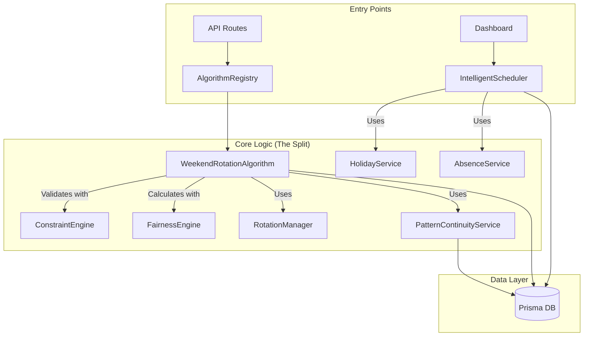

# Algorithm Dependency & Logic Map

**Stage 0, Task 0.2: Map Algorithm Dependencies**  
**Date:** November 22, 2024

---

## Executive Summary

The scheduling architecture suffers from a **Split Brain** problem. 

1.  **Generation Brain (`WeekendRotationAlgorithm`)**: Used to create schedules. Massive, monolithic class (900+ lines) with hardcoded patterns and embedded logic.
2.  **Resolution Brain (`IntelligentScheduler`)**: Used to fix conflicts. Contains sophisticated strategies (Workload Balance, Experience Based) that are **NOT** used during generation.

**Critical Finding:** The "Intelligent" features (strategies, sophisticated assignment) are largely bypassed during the primary schedule generation, which relies on hardcoded rotation patterns.

---

## 1. Service Dependency Graph



### The Disconnects
*   `WeekendRotationAlgorithm` manually checks holidays/vacations inside loops (lines 215, 242), duplicating logic found in `HolidayService` and `AbsenceService` used by `IntelligentScheduler`.
*   `IntelligentScheduler` has `AssignmentStrategy` logic (Round Robin, Workload Balance) that is **completely absent** from `WeekendRotationAlgorithm`.

---

## 2. Logic Duplication & Fragmentation

| Feature | WeekendRotationAlgorithm (Generation) | IntelligentScheduler (Resolution) | Status |
| :--- | :--- | :--- | :--- |
| **Assignment Logic** | Hardcoded `SUN_THU`, `MON_FRI` patterns | Dynamic Strategies (`WORKLOAD_BALANCE`, `EXPERIENCE`) | ❌ **Fragmented** |
| **Holiday Checks** | Manual inline DB checks | Uses `HolidayService` | ❌ **Duplicated** |
| **Absence Checks** | Manual inline checks | Uses `AbsenceService` | ❌ **Duplicated** |
| **Screener Logic** | Complex scoring system (lines 741-796) | Simple availability check | ❌ **Inconsistent** |
| **Fairness** | Uses `FairnessEngine` post-generation | "Workload Weight" embedded in strategies | ❌ **Disconnected** |

---

## 3. Hardcoded Business Logic (Technical Debt)

The `WeekendRotationAlgorithm.ts` contains critical business logic hardcoded directly into the class, making it impossible to configure without code changes.

**1. Rotation Patterns (Lines 361-365):**
```typescript
const workPatterns = [
  { name: 'SUN_THU', days: [0, 1, 2, 3, 4], nextPattern: 'TUE_SAT' },
  { name: 'MON_FRI', days: [1, 2, 3, 4, 5], nextPattern: 'SUN_THU' },
  { name: 'TUE_SAT', days: [2, 3, 4, 5, 6], nextPattern: 'MON_FRI' }
];
```
*   **Impact:** Cannot change shift patterns (e.g., 4x10, rotating weekends) without deploying code.

**2. Screener Scoring Penalties (Lines 752-784):**
```typescript
if (recentScreenerDays >= 2) score -= 1000;
if (screenedYesterday) score -= 500;
if (isInRotation) score -= 2000; // or 200
```
*   **Impact:** "Magic numbers" control assignment behavior. Tuning these requires code changes.

**3. Cycle Calculation (Line 368):**
```typescript
const cycleStartDate = new Date('2025-01-01'); // Reference date
```
*   **Impact:** Hardcoded anchor date for 3-week rotation cycles.

---

## 4. Data Flow Analysis

### Current Flow (Generation)
1.  **Input:** Date Range, Analyst List.
2.  **Step 1 (Regular Shifts):** 
    *   Fetch `RotationManager` plans.
    *   Loop days -> Loop analysts -> Check hardcoded patterns.
    *   **Issue:** Ignores `AssignmentStrategy` configuration.
3.  **Step 2 (Screeners):**
    *   Separate pass `generateScreenerSchedules`.
    *   Uses "Magic Number" scoring system.
    *   **Issue:** Completely separate logic from regular shift assignment.
4.  **Step 3 (Validation):**
    *   Run `ConstraintEngine`.
    *   Run `FairnessEngine`.
    *   **Issue:** Validation happens *after* generation, leading to potential "retry" loops or suboptimal results.

### Desired Flow (v1.0 Goal)
1.  **Unified Engine:** Single entry point for Generation AND Resolution.
2.  **Strategy Pattern:** Inject `AssignmentStrategy` (Pattern-based, Workload-based, etc.).
3.  **Centralized Constraints:** `ConstraintEngine` used *during* candidate selection, not just after.
4.  **Configurable Logic:** Move patterns and scoring weights to database/config.

---

## Recommendations for Stage 2 (Algorithm Refactoring)

1.  **Extract Patterns:** Move hardcoded patterns from `WeekendRotationAlgorithm` to a `PatternRegistry` or Database.
2.  **Unify Services:** Force `WeekendRotationAlgorithm` to use `HolidayService` and `AbsenceService`.
3.  **Merge Brains:** 
    *   Refactor `WeekendRotationAlgorithm` to use the *Strategies* defined in `IntelligentScheduler`.
    *   Or, deprecate `IntelligentScheduler`'s assignment logic and move it into the main algorithm as a Strategy.
4.  **Externalize Scoring:** Move the "Magic Numbers" for screener assignment into a configurable `ScoringProfile`.

---

**Next Step:** Stage 0, Task 0.3 - Test Current Functionality (Manual Verification).
