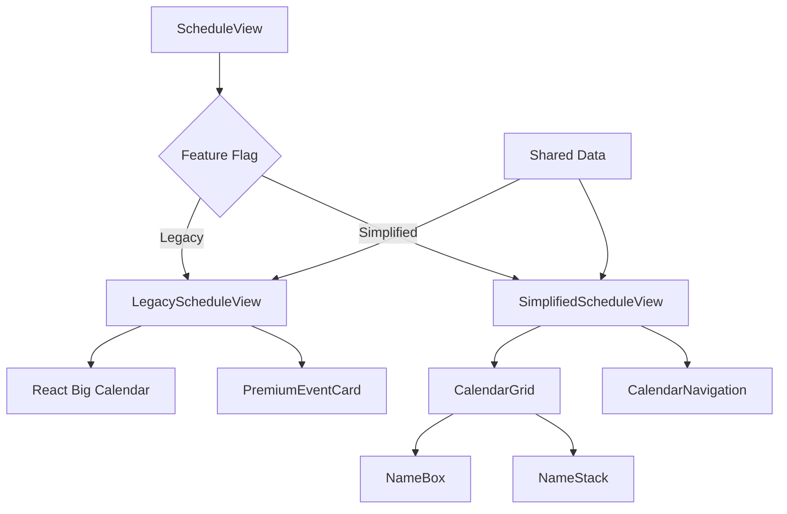

# 🔄 ShiftPlanner Calendar Migration Plan
**From React Big Calendar to Custom Simplified Calendar**

## 🎯 **Migration Objectives**
- **Zero Breaking Changes**: Maintain all existing functionality during transition
- **Backwards Compatibility**: Preserve current API interfaces
- **Incremental Rollout**: Feature-flag based implementation
- **Performance Improvement**: Reduce bundle size and rendering time
- **UX Enhancement**: Deliver simplified "who works when" interface

---

## 📊 **Current State Analysis**

### **Existing ScheduleView Component Dependencies**
```typescript
// Current Critical Interfaces
interface ScheduleViewProps {
  onViewChange: (view: AppView) => void;
  date: Date;
  setDate: (date: Date) => void;
  view: BigCalendarView;          // ← MIGRATION IMPACT
  setView: (view: BigCalendarView) => void; // ← MIGRATION IMPACT
  timezone: string;
  onError?: (error: string) => void;
  onSuccess?: (message: string) => void;
  isLoading?: (loading: boolean) => void;
}

// Current Data Flow
schedules[] → calendarEvents[] → React Big Calendar → Premium Event Cards
```

### **Key Functionality to Preserve**
- ✅ **Month/Week/Day view switching** (simplify to Month/Week only)
- ✅ **Date navigation** (prev/next month/week)
- ✅ **Timezone handling** (moment-timezone integration)
- ✅ **Event display** (analyst names + shift types)
- ✅ **Mobile swipe gestures** (left/right navigation)
- ✅ **Loading/error states** (existing error handling)
- ✅ **Event interactions** (click handling, tooltips)
- ✅ **Theme support** (light/dark mode integration)

### **Current Bundle Impact**
```
react-big-calendar: ~180kb (minified)
+ moment.js dependencies: ~50kb
+ Current CSS: 742 lines
= Total: ~230kb + heavy DOM manipulation

Target:
Custom Calendar: ~15kb
+ Simplified CSS: ~150 lines  
= Total: ~15kb + lightweight rendering
```

---

## 🔄 **Migration Strategy: Phased Approach**

### **Phase 1: Parallel Implementation (Week 1)**
**Goal**: Build new calendar alongside existing one with feature flag

```typescript
// Feature Flag Implementation
const useSimplifiedCalendar = process.env.REACT_APP_SIMPLIFIED_CALENDAR === 'true';

const ScheduleView = (props: ScheduleViewProps) => {
  if (useSimplifiedCalendar) {
    return <SimplifiedScheduleView {...props} />;
  }
  return <LegacyScheduleView {...props} />; // Current React Big Calendar
};
```

**Implementation Tasks:**
- [ ] Create `SimplifiedScheduleView.tsx` component
- [ ] Implement core month view rendering
- [ ] Add name box stacking logic
- [ ] Preserve all existing prop interfaces
- [ ] Add feature flag environment variable
- [ ] Create simplified CSS file (`SimplifiedCalendar.css`)

**Success Criteria:**
- New calendar renders same data as legacy version
- All existing props work without modification
- Feature flag toggles seamlessly between versions
- No performance regression in legacy mode

### **Phase 2: Feature Parity (Week 2)**
**Goal**: Achieve 100% functional parity with legacy calendar

**Implementation Tasks:**
- [ ] Month navigation (prev/next buttons)
- [ ] Date selection and highlighting
- [ ] Event click handling and tooltips
- [ ] Mobile swipe gesture support
- [ ] Loading and error state rendering
- [ ] Dark/light theme integration
- [ ] Timezone conversion handling

**Testing Checklist:**
```typescript
// Critical User Flows to Verify
✅ Month navigation works identically
✅ Event data displays correctly
✅ Mobile gestures function properly
✅ All click interactions preserved
✅ Theme switching works seamlessly
✅ Loading states match expectations
✅ Error handling maintains UX
✅ Timezone changes update display
```

### **Phase 3: Enhanced Features (Week 3)**
**Goal**: Add simplified calendar unique features

**New Features:**
- [ ] Smart name box stacking algorithm
- [ ] Responsive design improvements
- [ ] Performance optimizations
- [ ] Week view (simplified, name-focused)
- [ ] Accessibility enhancements

**Performance Targets:**
- [ ] <100ms initial render time
- [ ] <50ms month navigation
- [ ] <5MB memory footprint
- [ ] 60fps scroll performance

### **Phase 4: Migration & Cleanup (Week 4)**
**Goal**: Complete migration and remove legacy code

**Migration Tasks:**
- [ ] Enable simplified calendar by default
- [ ] A/B test with subset of users
- [ ] Collect performance metrics
- [ ] Remove React Big Calendar dependency
- [ ] Delete legacy code and CSS
- [ ] Update documentation

---

## 🛡️ **Backwards Compatibility Strategy**

### **Interface Preservation**
```typescript
// Maintain existing view type system
type BigCalendarView = 'month' | 'week' | 'day';

// Map to simplified views
const mapToSimplifiedView = (view: BigCalendarView): SimplifiedView => {
  switch (view) {
    case 'month': return 'month';
    case 'week': return 'week';
    case 'day': return 'month'; // Redirect day view to month
    default: return 'month';
  }
};

// Preserve all existing props
interface SimplifiedScheduleViewProps extends ScheduleViewProps {
  // No additional props required - full compatibility
}
```

### **Event Data Compatibility**
```typescript
// Preserve existing event structure
interface CalendarEvent {
  title: string;        // ← Keep: Analyst name
  start: Date;          // ← Keep: For date calculations
  end: Date;            // ← Keep: For duration info
  allDay: boolean;      // ← Keep: For compatibility
  resource: any;        // ← Keep: Shift data access
}

// Transform for simplified display
const transformToNameBox = (event: CalendarEvent) => ({
  name: event.title,
  shiftType: event.resource.shiftType,
  isScreener: event.resource.isScreener,
  date: event.start,
  // Preserve all original data for backwards compatibility
  _originalEvent: event
});
```

### **CSS Class Compatibility**
```css
/* Maintain existing CSS class names for external integrations */
.rbc-calendar { /* Simplified calendar container */ }
.rbc-month-view { /* Month grid container */ }
.rbc-date-cell { /* Day cell container */ }
.rbc-event { /* Name box container */ }
.rbc-today { /* Today highlight */ }

/* New simplified classes */
.simplified-calendar { /* New calendar styles */ }
.name-box { /* Individual name containers */ }
.name-stack { /* Multiple name containers */ }
```

---

## 🧪 **Testing Strategy**

### **Automated Testing**
```typescript
// Unit Tests
describe('SimplifiedScheduleView', () => {
  test('renders same events as legacy calendar', () => {
    const mockSchedules = generateMockSchedules();
    const legacy = render(<LegacyScheduleView schedules={mockSchedules} />);
    const simplified = render(<SimplifiedScheduleView schedules={mockSchedules} />);
    
    // Verify same analyst names appear
    expect(getAnalystNames(simplified)).toEqual(getAnalystNames(legacy));
  });

  test('maintains prop interface compatibility', () => {
    const props: ScheduleViewProps = {
      onViewChange: jest.fn(),
      date: new Date(),
      setDate: jest.fn(),
      view: 'month',
      setView: jest.fn(),
      timezone: 'America/New_York'
    };
    
    expect(() => render(<SimplifiedScheduleView {...props} />)).not.toThrow();
  });
});

// Integration Tests
describe('Calendar Migration', () => {
  test('feature flag toggles calendars correctly', () => {
    process.env.REACT_APP_SIMPLIFIED_CALENDAR = 'true';
    const { container } = render(<ScheduleView {...defaultProps} />);
    expect(container.querySelector('.simplified-calendar')).toBeInTheDocument();
    
    process.env.REACT_APP_SIMPLIFIED_CALENDAR = 'false';
    const { container: legacyContainer } = render(<ScheduleView {...defaultProps} />);
    expect(legacyContainer.querySelector('.rbc-calendar')).toBeInTheDocument();
  });
});
```

### **Manual Testing Checklist**
```
□ Month navigation (prev/next buttons)
□ Date selection and today highlighting  
□ Event data accuracy (names, colors, positions)
□ Mobile swipe gestures (left/right)
□ Responsive behavior (desktop/tablet/mobile)
□ Theme switching (light/dark mode)
□ Timezone changes and data updates
□ Loading states and error handling
□ Event interactions (click, tooltips)
□ Performance comparison (memory, render time)
```

---

## 📦 **Implementation Structure**

### **File Organization**
```
frontend/src/components/
├── ScheduleView.tsx                    # Main component with feature flag
├── calendar/
│   ├── LegacyScheduleView.tsx         # Current React Big Calendar impl
│   ├── SimplifiedScheduleView.tsx     # New custom calendar
│   ├── components/
│   │   ├── CalendarGrid.tsx           # Month grid component
│   │   ├── NameBox.tsx                # Individual name display
│   │   ├── NameStack.tsx              # Multiple names handling
│   │   └── CalendarNavigation.tsx     # Month/week navigation
│   ├── hooks/
│   │   ├── useCalendarData.tsx        # Data transformation
│   │   ├── useNameStacking.tsx        # Responsive stacking logic
│   │   └── useCalendarNavigation.tsx  # Navigation state
│   └── styles/
│       ├── SimplifiedCalendar.css     # New lightweight styles
│       └── NameBox.css                # Name box specific styles
└── ScheduleView.css                   # Legacy styles (to be removed)
```

### **Component Architecture**


---

## 🚨 **Risk Mitigation**

### **Rollback Strategy**
```typescript
// Environment-based rollback
const FALLBACK_TO_LEGACY = {
  on_error: true,
  performance_threshold: 1000, // ms
  user_feedback_score: 3.0
};

const ScheduleView = (props: ScheduleViewProps) => {
  const [useLegacy, setUseLegacy] = useState(false);
  
  const handleError = (error: Error) => {
    if (FALLBACK_TO_LEGACY.on_error) {
      console.error('Simplified calendar error, falling back to legacy:', error);
      setUseLegacy(true);
    }
  };
  
  if (useLegacy || !useSimplifiedCalendar) {
    return <LegacyScheduleView {...props} />;
  }
  
  return (
    <ErrorBoundary fallback={<LegacyScheduleView {...props} />}>
      <SimplifiedScheduleView {...props} onError={handleError} />
    </ErrorBoundary>
  );
};
```

### **Performance Monitoring**
```typescript
// Performance tracking during migration
const trackCalendarPerformance = (calendarType: 'legacy' | 'simplified') => {
  const startTime = performance.now();
  
  return {
    measureRender: () => {
      const renderTime = performance.now() - startTime;
      analytics.track('calendar_render_performance', {
        type: calendarType,
        render_time_ms: renderTime,
        memory_usage: (performance as any).memory?.usedJSHeapSize
      });
    }
  };
};
```

---

## 🎯 **Success Metrics**

### **Technical Metrics**
- **Bundle Size**: Reduce by >200kb
- **Render Time**: <100ms initial load
- **Memory Usage**: <5MB total
- **CSS Complexity**: <150 lines total

### **User Experience Metrics**
- **Task Completion**: Same or better than legacy
- **Error Rate**: <1% during migration
- **User Satisfaction**: >4.0/5.0 rating
- **Mobile Performance**: 60fps scroll on low-end devices

### **Business Metrics**
- **Zero Downtime**: No service interruptions
- **Feature Parity**: 100% functionality preservation
- **Development Velocity**: Faster future calendar features
- **Maintenance Cost**: Reduced code complexity

---

## 📅 **Timeline & Milestones**

### **Week 1: Foundation**
- Day 1-2: Set up feature flag and parallel structure
- Day 3-4: Implement basic month grid rendering
- Day 5: Name box display and basic styling

### **Week 2: Feature Parity**
- Day 1-2: Navigation and date handling
- Day 3-4: Event interactions and mobile support
- Day 5: Theme integration and error handling

### **Week 3: Enhancement**
- Day 1-2: Smart name stacking algorithm
- Day 3-4: Performance optimization and testing
- Day 5: Week view implementation (if needed)

### **Week 4: Migration**
- Day 1-2: A/B testing and metrics collection
- Day 3-4: Full migration and legacy cleanup
- Day 5: Documentation and monitoring

---

**Bottom Line**: This migration plan ensures **zero risk** to existing functionality while delivering a **dramatically simplified and faster** calendar experience. The phased approach allows for **immediate rollback** at any stage if issues arise.